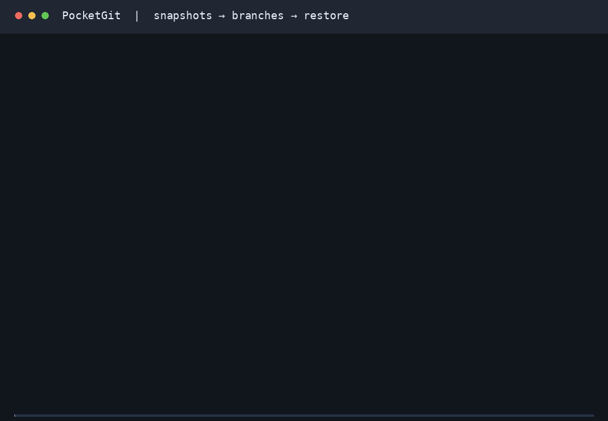
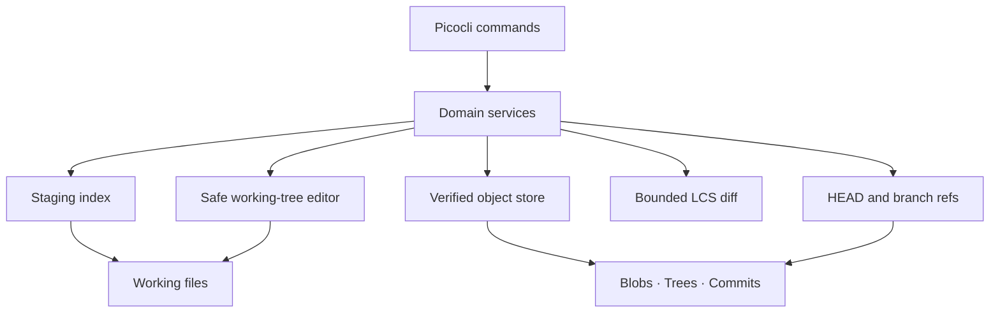

# PocketGit

[](https://github.com/shahrdazri-ctrl/Pocketgit/actions/workflows/ci.yml)

PocketGit is a Git-inspired version-control engine written from scratch in Java 21. It implements immutable content-addressable storage, SHA-256 object IDs, staging, commit trees, branches, safe checkout, history traversal, unified diffs, restoration, and integrity verification without invoking Git or using JGit.



The [recording](docs/screenshots/demo.cast) comes from the executable [demo script](examples/demo.sh), using the packaged CLI in a fresh temporary repository. It demonstrates the complete snapshot → branch → checkout → restore workflow.

## Features

- Byte-exact text and binary snapshots up to 64 MiB per file, streamed into immutable compressed objects and deterministic Trees.
- Independent HEAD, staging index, and working-tree comparisons; scoped staging and root ignore rules.
- Author configuration, parent-linked commits, branch creation/listing, history, and commit inspection.
- Branch checkout with staged-work, local-edit, untracked-file, and path-obstruction protection.
- Unified text diffs with three context lines; binary and executable-mode change reporting.
- Single-file restore from the index or a historical commit, plus whole-object and graph verification.
- [Optional JavaFX history viewer](docs/gui.md), separate from the self-contained CLI.

PocketGit repositories use `.pocketgit/`, their own formats, and SHA-256 IDs. They are separate from Git repositories; PocketGit does not read `.git/` or implement Git's protocols.

## Install and run

Requirements: **JDK 21+**; building from source also requires **Maven 3.9+**. Linux, macOS, and Windows are supported by the build and launchers. The filesystem must support hard links and atomic file replacement.

```bash
mvn clean verify
java -jar target/pocketgit.jar --help
java -jar target/pocketgit.jar --version
```

The executable JAR contains the CLI dependencies. Copy it to another directory and run `java -jar /path/to/pocketgit.jar ...`, or add this checkout's `bin/` to your PATH after building:

```bash
export PATH="$PWD/bin:$PATH"
pocketgit --help
```

On Windows, add the absolute `bin` directory to PATH and use `pocketgit.cmd`. Both launchers preserve the caller's working directory and honor `JAVA_HOME`. See [release and distribution](docs/release.md) for versioned artifacts, checksums, and the optional viewer.

## Quick start

```bash
mkdir demo
cd demo
pocketgit init
pocketgit config user.name "Jane Developer"
pocketgit config user.email "jane@example.com"

printf 'hello\n' > hello.txt
pocketgit add .
pocketgit commit -m "Initial commit"

printf 'world\n' >> hello.txt
pocketgit status
pocketgit diff
pocketgit add .
pocketgit diff --staged
pocketgit commit -m "Update hello"

pocketgit branch experiment
pocketgit checkout experiment
printf 'branch work\n' > experiment.txt
pocketgit add .
pocketgit commit -m "Experiment"

pocketgit checkout main
pocketgit log --oneline
pocketgit verify
```

To try the same workflow without choosing a directory, run `sh examples/demo.sh` from the source checkout. It creates a new temporary repository, verifies the restored bytes, and prints its location for inspection. It never cleans up existing directories.

`restore --commit COMMIT_PREFIX hello.txt` writes the historical bytes to the working file. **Restore discards that file's unstaged edits.** It leaves the index and branch unchanged; `restore hello.txt` then returns the file to its indexed version.

## Commands

| Command | Purpose |
| --- | --- |
| `init [DIRECTORY]` | Initialize an existing directory, preserving existing metadata. |
| `config user.name [VALUE]`, `config user.email [VALUE]` | Read or set repository-local author identity. |
| `add PATH` | Stage a file/directory and deletions within its scope. `add .` stages the entire repository, even from a nested directory. |
| `commit -m MESSAGE [--allow-empty]` | Commit the index on the current attached branch. |
| `status [--ignored]` | Show staged, unstaged, untracked, and optionally ignored paths. |
| `log [--oneline]` | Walk parent-linked history from HEAD, newest first. |
| `show COMMIT` | Inspect a commit using a full ID or unique lowercase hexadecimal prefix. |
| `branch [NAME]` | List branches or create one at the current commit without switching. |
| `checkout BRANCH` | Switch safely to an existing branch. |
| `diff [--staged]` | Compare index → working tree, or HEAD → index. |
| `restore [--commit COMMIT] FILE` | Replace one working file from the index or a commit. |
| `cat-object [--type\|--size\|--pretty] HASH` | Inspect a full-ID object; default output is its exact payload bytes. |
| `verify` | Validate HEAD, refs, all stored objects, reachable snapshots, and the index. |
| `gui` | Open the optional read-only history viewer when using the GUI artifact. |

Use `pocketgit COMMAND --help` for syntax. Exit codes are 0 for success/help, 1 for execution failures, and 2 for invalid arguments. `POCKETGIT_AUTHOR_NAME` and `POCKETGIT_AUTHOR_EMAIL` override their respective local author settings. Missing identity produces an actionable error.

PocketGit accepts UTF-8 `@argument-file` input, including quoted values and multiline messages. On Windows with Java 21, use this route for text outside the active Windows code page; see the [Unicode argument example](docs/release.md#unicode-arguments-on-windows-with-java-21).

## Architecture



Command classes parse arguments and format results; services own the behavior and can run without Picocli. `add` stores Blobs and publishes an index. `commit` constructs Trees from that index, writes a Commit, and then advances the branch. Checkout plans and validates every affected path before editing files. See [architecture](docs/architecture.md) for flow, consistency boundaries, and direct service APIs.

## Repository format

```text
.pocketgit/
├── HEAD                  # ref: refs/heads/main
├── index                 # versioned, sorted JSON staging snapshot
├── config                # local author settings
├── objects/ab/cdef…      # SHA-256 fan-out; one zlib stream per object
├── refs/heads/main       # full Commit ID, or empty before first commit
└── logs/HEAD             # commit/checkout ref-movement records
```

An object ID is `SHA-256(type + " " + payloadByteLength + NUL + payload)`. Blobs hold raw file bytes. Trees and Commits use canonical compact UTF-8 JSON; sorted entries and explicit property order make IDs deterministic. Every read validates the envelope and hash; semantic reads also validate canonical JSON. The [repository-format specification](docs/repository-format.md) contains the schemas needed to build an independent reader.

Root `.pocketgitignore` supports literal patterns, `*`, `?`, leading `/`, and directory suffix `/`. It does not support negation, `**`, escapes, or nested ignore files. `.pocketgit/` is always excluded; `.git/` is not implicitly excluded. See [staging](docs/staging.md) before initializing PocketGit inside another tool's checkout.

## Engineering decisions

- [SHA-256 and typed immutable objects](docs/decisions/001-object-format.md): hash canonical uncompressed bytes; publish exclusively with hard links.
- [Deterministic JSON snapshots](docs/decisions/002-index-and-tree-format.md): portable paths, sorted entries, and strict schema validation.
- [CLI and service separation](docs/decisions/003-cli-and-services.md): keep engine behavior testable without a terminal.
- [Atomic publication and cooperative locks](docs/decisions/004-metadata-publication.md): fail explicitly when required filesystem operations are unsupported.
- [Checkout before mutation](docs/decisions/005-safe-checkout.md): detect conflicts across files and directories; preserve unrelated work.
- [Bounded LCS diff](docs/decisions/006-diff-strategy.md): deterministic, inspectable diffs with explicit resource limits.
- [Streaming and private edit preparation](docs/decisions/007-streaming-and-edit-preparation.md): verify large Blobs with bounded buffers and retain recoverable originals on disk.

## Test and quality checks

`mvn clean verify` compiles Java 21, runs JUnit unit tests, enforces at least 80% core line coverage, packages the executable CLI, and runs integration tests in separate Java processes. Coverage output is in `target/site/jacoco/`. Test fixtures use temporary directories; engine code never launches Git. CI runs the same workflow on Ubuntu, Windows, and macOS; the JavaFX scene check exercises 1,001 changed files with virtualized rows.

Tests cover corruption, publication failure and rollback, lock contention, checkout conflicts, binary restore, portable-path aliases, terminal control sequences, shared history graphs, seeded snapshot round trips, and a 1,000-file mixed repository. A packaged workflow exercises the full 64 MiB file limit with a 96 MiB JVM heap. The [resource and recovery audit](docs/resource-audit.md) records these regressions and release evidence; the [earlier audit](docs/audit.md) records the preceding safety and portability work. [Phase 9 validation](docs/phase-9-validation.md) records coverage and benchmark observations; [phase reports](docs/phase-10-validation.md) distinguish local evidence from CI results.

Further behavior guides: [objects](docs/object-database.md), [commits](docs/commits.md), [status](docs/status.md), [history](docs/history-and-branches.md), [checkout](docs/checkout.md), [diff/restore](docs/diff-and-restore.md), and [integrity](docs/integrity.md). [pocketgit.md](pocketgit.md) remains the authoritative development specification.

## Limits and roadmap

Version 1.0 creates single-parent commits and switches existing branches. Merge, detached checkout, branch deletion, directory restore, staged restore, remote synchronization, Git compatibility, packfiles, and garbage collection are future work.

Objects and individual working files are limited to 64 MiB. Textual diff inputs are limited to 8 MiB and 100,000 lines each, with at most 4,000,000 changed-region LCS cells; a command also caps combined text inputs at 32 MiB and output at 250,000 hunk lines. Pretty object inspection is capped at 8 MiB and escapes terminal controls. Checkout preparation uses at most 256 MiB of private disk storage for content and backups. POSIX executable modes are preserved where supported; other platforms use regular-file modes. Symlinks are rejected. Snapshot names must be portable: Windows device names, trailing dots/spaces, and case/Unicode-normalization aliases are rejected on every platform.

Metadata replacements are individually atomic, and ordinary checkout/restore failures attempt rollback. Multi-file operations are not crash-atomic; power loss or process termination can leave partial work, locks, and temporary files. Incomplete working-file rollback retains its private backups and a path manifest for manual recovery. Locks coordinate PocketGit writers, not external editors. [Recovery guidance](docs/integrity.md) explains inspecting and removing stale locks; `verify` diagnoses metadata and objects without repairing them.

Future work starts with durable transaction recovery and three-way merge, followed by tags, reflog recovery, object collection, and optional remote transport. Native installers are optional distribution improvements; Java 21 and the self-contained CLI JAR remain the baseline.
