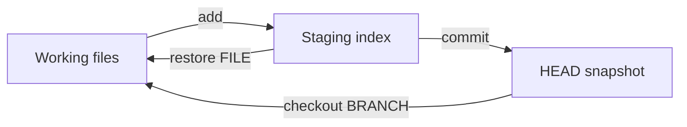
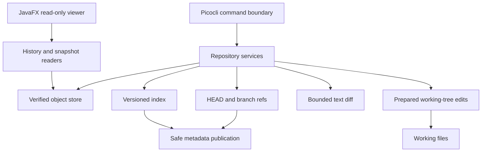
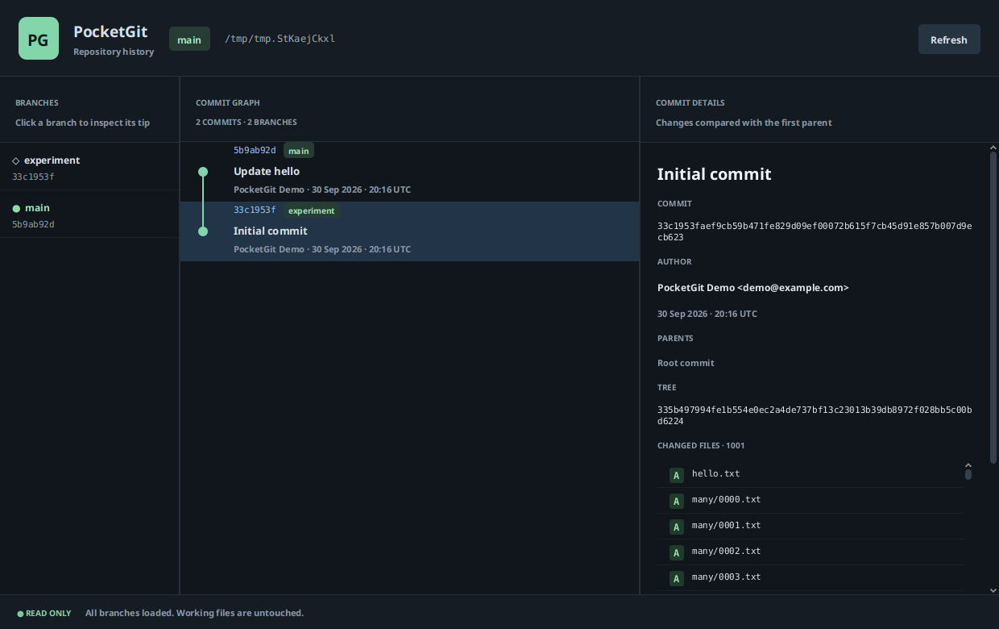

# PocketGit

[](https://github.com/shahrdazri-ctrl/Pocketgit/actions/workflows/ci.yml)

**A version-control engine built from first principles in Java 21.**

PocketGit implements content-addressable storage, deterministic snapshots, a staging
index, parent-linked commit history, safe branch switching, unified diffs, byte-exact
restoration, and repository verification. Its engine owns these operations: SHA-256,
zlib, filesystem publication, graph traversal, and diff computation run in Java.
Picocli handles command parsing; Jackson handles structured metadata.

Designed and maintained by [**shahrdazri-ctrl**](https://github.com/shahrdazri-ctrl).

[Get started](#get-started) · [Architecture](#architecture) ·
[Storage](#storage-and-integrity) · [Safety](#working-tree-safety) ·
[Verification](#verification-and-quality) · [Documentation](docs/README.md)


The recording executes the [demo script](examples/demo.sh) against a packaged JAR in
a fresh repository. The [source recording](docs/screenshots/demo.cast) is available
for replay and inspection.

## Project scope

PocketGit is a local version-control system with its own `.pocketgit/` repository
format. It exposes the familiar separation between committed state, staged state,
and working files, while keeping storage and mutation rules small enough to inspect
and test independently. It does not invoke Git or JGit, read Git repositories, or
implement Git's transport protocols.

The project concentrates on the difficult boundaries of a filesystem-backed engine:
validating untrusted metadata, producing stable object IDs, preserving unrelated
work during checkout, reporting partial publication accurately, and bounding resource
usage. The [engineering specification](pocketgit.md), [architecture](docs/architecture.md),
and [design decisions](docs/README.md#design-decisions) document those choices.

| Engineering area | Implementation | Evidence |
| --- | --- | --- |
| Object integrity | Typed SHA-256 IDs; one validated zlib stream; exact payload lengths; canonical Tree/Commit JSON. | [Object storage regressions](src/test/java/com/pocketgit/unit/ObjectStoreTest.java), [format specification](docs/repository-format.md). |
| Working-file safety | A complete conflict plan before mutation; revalidation; atomic replacements; private rollback preparation. | [Checkout regressions](src/test/java/com/pocketgit/unit/CheckoutServiceTest.java), [editor lifecycle tests](src/test/java/com/pocketgit/unit/WorkingTreeEditLifecycleTest.java). |
| Resource control | Streaming Blob publication/inspection; bounded edit preparation, text inputs, LCS matrices, and command output. | [64 MiB low-heap workflow](src/test/java/com/pocketgit/integration/LargeFileIT.java), [diff limits](src/test/java/com/pocketgit/unit/DiffServiceResourceTest.java). |
| Portable repository inputs | Validated paths and branch namespaces; case/normalization collision checks; Unicode-aware ignore matching. | [Portable reference tests](src/test/java/com/pocketgit/unit/PortableRefsTest.java), [independent ignore oracle](src/test/java/com/pocketgit/unit/IgnoreMatcherTest.java). |
| History processing | Bounded iterative traversal; cycle detection; shared ancestors read once across multiple roots. | [Shared-history tests](src/test/java/com/pocketgit/unit/HistoryForestTest.java), [history readers](src/main/java/com/pocketgit/services/LogService.java). |
| Distribution | Self-contained CLI JAR; optional platform-specific JavaFX artifact; versioned files and SHA-256 manifests. | [Release guide](docs/release.md), [CI workflow](.github/workflows/ci.yml). |

## Get started

### Build the CLI

Requirements are **JDK 21+** and **Maven 3.9+**. Storage requires a filesystem that
supports hard links and atomic file replacement. Linux, macOS, and Windows have
launchers and configured native CI jobs.

```bash
git clone https://github.com/shahrdazri-ctrl/Pocketgit.git
cd Pocketgit
mvn clean verify
java -jar target/pocketgit.jar --version
java -jar target/pocketgit.jar --help
```

`verify` checks formatting, compiles the project, runs unit tests and packaged-process
integration tests, enforces core coverage, checks selected SpotBugs findings, and
produces release checksums. The CLI JAR includes its runtime dependencies; a separate
JavaFX installation is unnecessary for CLI use.

The resulting distribution files are:

```text
target/pocketgit.jar
target/pocketgit-1.0.0.jar
target/pocketgit-1.0.0.jar.sha256
```

Copy the versioned JAR and checksum together when distributing a build. To verify
on Linux, run `sha256sum -c pocketgit-1.0.0.jar.sha256` from `target/`; on macOS use
`shasum -a 256 -c pocketgit-1.0.0.jar.sha256`. PowerShell users can compare
`Get-FileHash -Algorithm SHA256` with the manifest. See [release and distribution](docs/release.md)
for packaging details and reproducibility checks.

### Use the launchers

From the source checkout on Linux or macOS:

```bash
export PATH="$PWD/bin:$PATH"
pocketgit --help
```

On Windows, add the absolute `bin` directory to `PATH` and use `pocketgit.cmd`.
Both launchers honor `JAVA_HOME` and preserve the caller's working directory.
Alternatively, invoke `java -jar /absolute/path/pocketgit-1.0.0.jar COMMAND` anywhere.

### Run a complete repository workflow

Use a new working directory. PocketGit excludes its own `.pocketgit/` metadata;
`.git/` is not implicitly ignored when staging another tool's checkout.

```bash
mkdir pocketgit-example
cd pocketgit-example
pocketgit init
pocketgit config user.name "Jane Developer"
pocketgit config user.email "jane@example.com"

printf 'hello\n' > hello.txt
pocketgit add .
pocketgit commit -m "Initial snapshot"

printf 'world\n' >> hello.txt
pocketgit status
pocketgit diff
pocketgit add .
pocketgit diff --staged
pocketgit commit -m "Extend greeting"

pocketgit branch experiment
pocketgit checkout experiment
printf 'branch work\n' > experiment.txt
pocketgit add .
pocketgit commit -m "Add experiment"

pocketgit checkout main
pocketgit log --oneline
pocketgit verify
```

`add` changes the proposed snapshot; `commit` records the index rather than implicitly
staging working files. Switching back to `main` removes the experiment's tracked file
because it is absent from that branch's snapshot. The existing `hello.txt` remains
byte-exact. For an executable demonstration with assertions, run:

```bash
sh examples/demo.sh
```

The script checks branch transitions and historical/index restoration, verifies the
repository, and leaves its fresh temporary directory available for inspection.

### Restore a selected file

`pocketgit restore hello.txt` writes the indexed bytes back to that working file.
`pocketgit restore --commit COMMIT_PREFIX hello.txt` writes bytes from a historical
snapshot. Both deliberately **discard the named file's unstaged edits** while leaving
the index and branch unchanged. A missing source path is an error, not a deletion.
See [diff and restore](docs/diff-and-restore.md) for the complete contract.

## The three repository states



HEAD identifies the committed snapshot, the index holds the proposed next snapshot,
and the working tree contains current files. File identity includes both its Blob ID
and regular/executable mode. A path can therefore have staged and unstaged changes
at the same time.

| Inspection | Comparison | What it reports |
| --- | --- | --- |
| `status` | HEAD → index and index → working tree | Staged additions/modifications/deletions, unstaged modifications/deletions, and untracked paths. |
| `diff --staged` | HEAD → index | Proposed content and mode changes for the next commit. |
| `diff` | Index → working tree | Unstaged changes to indexed paths; untracked files are excluded. |

Status hashes actual working bytes rather than trusting file timestamps. Index and
committed Blobs are also verified with streaming readers. The [status guide](docs/status.md)
describes ignored paths, missing files, and observation of concurrently changing state.

## Command reference

| Command | Contract |
| --- | --- |
| `init [DIRECTORY]` | Initialize an existing directory without overwriting existing metadata. |
| `config user.name [VALUE]`, `config user.email [VALUE]` | Read or set repository-local author identity. |
| `add PATH` | Stage file/directory contents and tracked deletions within scope. `add .` covers the repository even from a nested directory. |
| `commit -m MESSAGE [--allow-empty]` | Create a snapshot from the index and advance the attached branch. |
| `status [--ignored]` | Inspect staged, unstaged, untracked, and optionally ignored paths. |
| `log [--oneline]` | Inspect parent-linked history from HEAD. Shared ancestors are emitted once. |
| `show COMMIT` | Display commit metadata using a full ID or unique lowercase hexadecimal prefix. |
| `branch [NAME]` | List branches or create a ref at the current commit; creation does not switch branches. |
| `checkout BRANCH` | Materialize an existing branch after checking staged work, affected local changes, and path obstructions. |
| `diff [--staged]` | Render bounded unified text diffs, binary summaries, and mode changes. |
| `restore [--commit COMMIT] FILE` | Replace one explicitly selected working file from the index or a commit. |
| `cat-object [--type\|--size\|--pretty] HASH` | Inspect a full-ID object. Default mode extracts its exact payload bytes. |
| `verify` | Check HEAD, refs, all stored objects, graph relationships, reachable snapshots, and index references. |
| `gui` | Open the read-only history viewer from the optional GUI artifact. |

Use `pocketgit COMMAND --help` for argument details. Exit codes are **0** for
success/help, **1** for execution failures, and **2** for invalid arguments.
Execution errors identify the affected operation without a Java stack trace.

`POCKETGIT_AUTHOR_NAME` and `POCKETGIT_AUTHOR_EMAIL` override their respective local
settings. Missing or invalid identity blocks commit creation. UTF-8 `@argument-file`
input supports quoted values and multiline messages. For characters outside the
active Windows code page on Java 21, use the documented [Unicode argument-file route](docs/release.md#unicode-arguments-on-windows-with-java-21).

## Architecture



Commands parse and present results; services own repository behavior. Explicit
working paths, injected clocks, environment lookups, and failure hooks make storage
and mutation logic testable without a process-global working directory or terminal.
The JavaFX viewer reuses verified readers and runs storage work outside the UI thread.

| Boundary | Responsibility | Source |
| --- | --- | --- |
| Domain models | Immutable validated Blobs, Trees, Commits, index entries, modes, and result values. | [model](src/main/java/com/pocketgit/model) |
| Storage | Canonical serialization, streaming envelopes, immutable publication, bounded metadata reads, and locks. | [storage](src/main/java/com/pocketgit/storage) |
| Repository services | Staging, commit construction, status, history, diff, restore, and checkout coordination. | [services](src/main/java/com/pocketgit/services) |
| Filesystem and references | Repository discovery, working-state observation, safe paths, HEAD, and portable ref namespaces. | [repository](src/main/java/com/pocketgit/repository), [refs](src/main/java/com/pocketgit/refs) |
| Validation and algorithms | Whole-store verification, graph checks, bounded LCS, portable names, and terminal-safe presentation. | [validation](src/main/java/com/pocketgit/validation), [diff](src/main/java/com/pocketgit/diff), [utilities](src/main/java/com/pocketgit/util) |
| Frontends | Picocli commands and optional JavaFX scene. | [CLI](src/main/java/com/pocketgit/cli), [viewer](src/gui/java/com/pocketgit/gui) |

The [architecture guide](docs/architecture.md) follows the publication and rollback
boundaries in detail. The [decision records](docs/README.md#design-decisions) explain
why this design uses strict JSON, hard-link publication, cooperative locks, and a
bounded LCS implementation.

## Storage and integrity

```text
.pocketgit/
├── HEAD                  # Symbolic branch ref or detached Commit ID
├── index                 # Versioned, sorted staging snapshot
├── config                # Repository-local author settings
├── objects/ab/cdef…      # SHA-256 fan-out, one zlib stream per object
├── refs/heads/main       # Commit ID, or empty before the first commit
├── logs/HEAD             # Commit and checkout movement records
└── edit-*/               # Private transient working-file preparation
```

An object's identity is computed over its uncompressed canonical envelope:

```text
SHA-256(ASCII(type) + " " + ASCII(payloadByteLength) + NUL + payload)
```

The type is `blob`, `tree`, or `commit`. Blobs contain exact file bytes. Trees contain
sorted directory entries; Commits reference a root Tree, ordered parents, author,
timestamp, and message. Compact UTF-8 JSON, explicit property order, and canonical
reserialization prevent multiple accepted encodings of the same semantic object.
Compression choices do not alter object identity.

The object store verifies headers, types, lengths, the complete zlib stream, trailing
data, and SHA-256. New objects publish through an exclusive hard link after their
private compressed file is forced. An existing object is verified before reuse;
corrupt content is reported rather than replaced silently.

`verify` scans unreachable objects as well as referenced history. It checks the
index, direct type-correct references, parent graphs, flattened snapshots, and
portable ref namespaces. It reports deterministic errors and performs no repair or
collection. Working-file bytes, author configuration, ignore rules, and historic
reflog semantics are outside that scan. See the [format specification](docs/repository-format.md),
[object API](docs/object-database.md), and [integrity guide](docs/integrity.md).

## Working-tree safety

Checkout is a planned mutation with explicit failure boundaries:

1. Verify source/target objects and read HEAD/index under cooperative writer locks.
2. Build a complete write/removal/conflict plan. Staged work blocks switching;
   affected local changes and conflicting untracked/ignored paths block overwrites.
3. Prepare exact originals and replacements in a private disk directory, then
   revalidate metadata, working bytes, identity, permissions, and formerly absent paths.
4. Force and atomically replace complete files, preserving existing required parent
   directories, then publish index, HEAD, and reflog replacements.
5. On ordinary failure, attempt file and independent metadata recovery. Retain
   private original backups and report their location if working-file recovery fails.

Unrelated local edits and untracked files survive a successful switch. File/directory
transitions are supported only when they preserve unrelated paths and directories.
There is no force-checkout option.

The distinction between atomic file replacement and a durable multi-file transaction
is explicit. Checkout/restore attempt ordinary-failure rollback; process termination
or power loss can leave partial work, temporary files, or locks. External editors do
not participate in PocketGit locks. Ref and reflog publication are separate atomic
operations; a commit that was published before a later failure is reported with its
ID. [Checkout](docs/checkout.md) and [recovery guidance](docs/integrity.md#private-preparation-and-working-file-recovery)
explain inspection and manual recovery.

## Verification and quality

The release gate exercises **473 tests: 441 unit cases and 32 packaged integration
cases**. Integration tests start fresh Java processes against the runnable JAR;
engine tests use isolated repositories and inspect actual bytes and metadata.
[Validation evidence](docs/validation.md) records the measured coverage, environment,
checksums, and provenance of platform results.

| Check | What it establishes |
| --- | --- |
| Spotless | Pinned formatting for engine, test, and GUI Java sources; checked during Maven validation. |
| JUnit | Deterministic serialization, repository behavior, failure injection, portable inputs, and algorithm regressions. |
| JaCoCo | An 80% core line-coverage gate; CLI/bootstrap/UI have separate boundary checks. |
| Packaged integration tests | Process restarts, launcher behavior, parsing, Unicode, exact extraction, and complete snapshot workflows. |
| SpotBugs | Selected high-priority correctness and concurrency findings at maximum effort. |
| JavaFX scene check | Actual selection/details, 1,001 changed-file records, bounded visible cells, and unchanged metadata manifests. |
| Release manifests | Digests of the versioned CLI and GUI JARs. |

Important regression strategies include a 2,000-case seeded ignore matcher oracle,
shared history forests, corruption and missing objects, publication failures,
blocked rollback, lock contention, path/ref aliases, terminal controls, and seeded
snapshot round trips. A maximum-size 64 MiB Blob workflow runs in separate JVMs
with `-Xmx96m`, checking stage/restage, commit, diff, restore, checkout, status,
verification, and exact raw extraction.

CI runs native CLI gates on Ubuntu, Windows, and macOS; the optional GUI build and
headless scene run on Linux. The status badge links to current workflow results.
Historical native runs and local checks are recorded separately; a configured job
is not a claim that a particular revision passed it.

For focused work:

```bash
mvn -Dtest=CheckoutServiceTest test
mvn spotless:apply
mvn clean verify
```

See [development workflow](docs/development-workflow.md) and [maintainer guidance](CONTRIBUTING.md)
for change review, dependency updates, and acceptance criteria.

## Optional history viewer



The viewer displays branch tips, child-before-parent history, parent links, commit
metadata, and sorted changed paths. It reads through the same verified services,
loads data on a background worker, cancels obsolete selection tasks, and virtualizes
large file lists. Selecting a branch changes the view rather than repository HEAD.

```bash
mvn -Pgui clean verify
java -jar /absolute/path/pocketgit-gui-1.0.0.jar gui
```

Build this artifact on its target operating system so JavaFX native libraries match.
It requires a desktop display; CI uses checksum-pinned Monocle and software rendering
for offscreen validation. The ordinary CLI artifact remains independent of JavaFX.
`clean` removes artifacts from the preceding profile, so save a CLI release outside
`target/` before building the viewer. See the [viewer guide](docs/gui.md).

## Resource policy and compatibility

| Resource or behavior | Supported bound |
| --- | --- |
| Object payload / staged file | 64 MiB by default. Blob workflows stream; Tree/Commit decoding and retaining embedding APIs still use payload memory. |
| Working-file edit preparation | 256 MiB combined original/replacement content on private disk. |
| Index | 16 MiB serialized metadata. |
| Snapshot traversal | 256 path components and 100,000 expanded nodes. |
| Commit-history traversal | 100,000 distinct commits. |
| Text diff input | 8 MiB and 100,000 lines per side. |
| Changed-region LCS matrix | 4,000,000 cells in a flat array. |
| One diff command | 32 MiB combined text inputs and 250,000 retained hunk lines. |
| Pretty object inspection | 8 MiB; terminal/directional controls escaped. Raw mode remains byte-exact. |
| Viewer | Up to 2,000 displayed commits; 15 graph lanes plus a condensed overflow column. |

Snapshot and ref names reject traversal, Windows device names, trailing dots/spaces,
and separate case or Unicode-normalization aliases. Symlinks and unsupported file
types are rejected. POSIX executable distinction is preserved where available;
other platforms use regular-file modes. Additional filesystem path-length limits
still apply.

Root `.pocketgitignore` supports literal patterns, `*`, `?`, leading `/`, and directory
suffix `/`. Negation, `**`, escapes, and nested ignore files are outside the supported
subset. Unicode matching operates on code points with a bounded greedy algorithm.
See [staging](docs/staging.md) for exact scope and matching semantics.

## Development direction

Version 1.0 creates single-parent commits and switches existing branches. Durable
transaction recovery and three-way merge are the next substantial design problems.
Detached checkout, tags, reflog recovery, staged/directory restore, packfiles,
garbage collection, and remote transport require separate specifications and
acceptance tests. These are roadmap items rather than current capabilities.

The engineering process is owner-led and requirements-driven. Agent-assisted work
is evaluated against storage invariants, regression evidence, reviewable diffs, and
release gates. Project ownership is assigned to `shahrdazri-ctrl` through
[CODEOWNERS](.github/CODEOWNERS) and build metadata. The repository maintains a single
`main` branch; scheduled dependency-update PRs are disabled and dependency changes
are reviewed directly against the same release checks.

## Documentation

Start with the [documentation index](docs/README.md). It separates current contracts,
design decisions, validation evidence, and historical implementation records.

- [Engineering specification](pocketgit.md): product scope, invariants, operation contracts, and acceptance requirements.
- [Architecture](docs/architecture.md): boundaries, publication flow, graph processing, and consistency.
- [Repository format](docs/repository-format.md): independent-reader schemas and compatibility rules.
- [Working-tree safety](docs/checkout.md) and [integrity/recovery](docs/integrity.md): mutation and recovery boundaries.
- [Development workflow](docs/development-workflow.md) and [validation evidence](docs/validation.md): how changes are assessed and reproduced.
