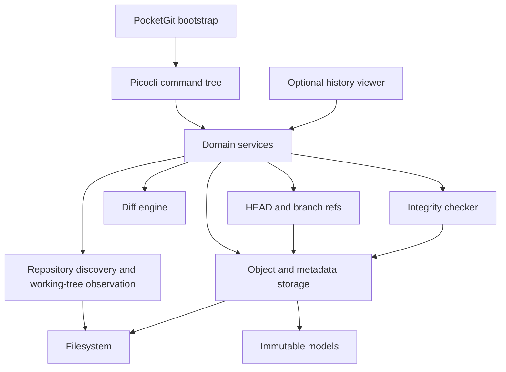
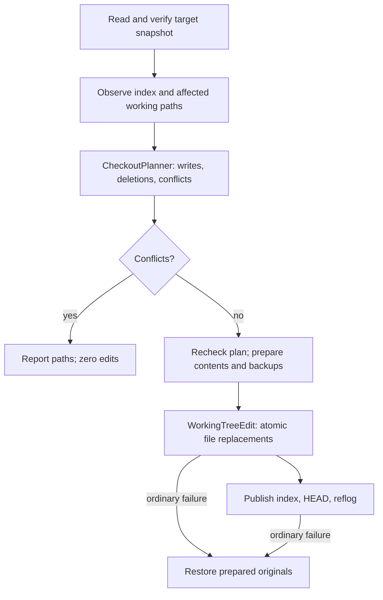

# PocketGit architecture

PocketGit's engine is Java 21 code over `java.nio.file`, SHA-256, zlib, and strict JSON. Picocli and Jackson provide parsing and serialization; Git and JGit are absent from the engine. The JavaFX viewer is an optional, separate frontend over the same verified repository readers.

## Layers and dependencies

`PocketGit` assembles the CLI and maps expected exceptions to concise execution errors. Command classes parse arguments, invoke services, and format results. Services accept explicit working directories rather than changing process-global state, and can be tested or used without Picocli. Raw `cat-object` payloads use a byte output stream, keeping arbitrary binary content out of character encoding.

`Repository` is an immutable path abstraction with centralized metadata locations. `RepositoryLocator` walks parents from the physical starting directory to the nearest real `.pocketgit` directory; unsafe markers produce an error rather than falling through to an outer repository. `RepositoryInitializer` claims a new metadata directory exclusively and creates files without replacement. Existing metadata and user files are preserved.

## Immutable objects and snapshots

`ObjectHasher` hashes the typed canonical envelope. `ObjectWriter` compresses into a forced private file and publishes exclusively using a hard link. `ObjectReader` validates exactly one complete zlib stream, the header and payload length, the maximum size, and the content hash. `ObjectPaths` validates IDs and rejects observed metadata symlinks. `ObjectStore` exposes these operations and resolves unique lowercase hash prefixes for history/restore.

`Blob`, `StoredObject`, `Index`, `IndexEntry`, `Tree`, `TreeEntry`, `Commit`, and `AuthorIdentity` are immutable validated values; byte arrays are copied defensively. `ObjectCodec` defines compact canonical Tree/Commit JSON with explicit property order. Semantic reads reject representations that differ from canonical reserialization.

`TreeBuilder` creates nested Trees bottom-up from verified indexed Blobs. `TreeReader` verifies and flattens stored snapshots into sorted, index-shaped file entries. Active-path cycle detection and expansion/depth bounds prevent uncontrolled graph traversal. `HeadSnapshotReader` resolves the branch tip and returns an empty snapshot for an unborn branch.

## Staging, commits, and status

`AddService` plans the requested scope, matches root ignore rules, stages new/modified bytes and tracked deletions, and atomically replaces the index under `index.lock`. `PathUtils` validates portable relative paths and safe working-tree resolution. `FileModeUtils` maps POSIX execute permission bits to file modes. `IgnoreMatcher` implements the documented small grammar rather than claiming Git wildcard compatibility.

`CommitService` holds the index and commit locks, verifies the current snapshot, resolves local/environment author identity, builds Trees and Commit, and prepares the ref and reflog. It rechecks HEAD/ref before publication. A ref is published only after its objects exist and have been verified. Ref and reflog are individually atomic; if the log fails after publication, `PublishedCommitException` identifies the already-published commit rather than implying nothing happened. `ConfigStore` uses an independent lock and strict local JSON; no identity is fabricated.

`WorkingTree` hashes tracked content on every observation and discovers untracked/ignored files. `StatusService` independently compares HEAD → index and index → working tree, allowing the same path to have both staged and unstaged changes. It validates referenced Blobs and rechecks index/HEAD after observation. `StatusFormatter` renders deterministic categories. Status makes no object, index, ref, or reflog writes.

## History and refs

`HeadManager.Head` represents symbolic and detached HEAD separately. Readers recognize both, while normal commits and checkout use attached branches. `RefStore` validates branch names and nested ref paths, reads existing refs, and prepares complete replacements or exclusive new refs. `BranchService` coordinates branch creation with commits through `commit.lock`; it does not rewrite files or switch HEAD.

`LogService` iteratively traverses Commit parents with visited/active sets and a bound. Injectable readers allow cycles and very deep graphs to be tested independently. `CommitFormatter` formats log/show metadata. Missing parents, ambiguous prefixes, wrong types, and corrupt payloads fail explicitly.

## Checkout and restore

`CheckoutPlanner` separates decisions from mutation. Staged changes block a switch. Changed tracked paths are checked for unstaged edits/deletions, and untracked/ignored files, directories, symlinks, and ancestor/descendant obstructions are protected. Unrelated working changes survive. Verified source objects are read before edits; content/backup preparation has an explicit memory bound.

`CheckoutService` takes `index.lock` then `commit.lock`, checks the complete plan again, and applies it through `WorkingTreeEdit`. The editor prepares complete files, forces contents, replaces atomically, preserves executable modes where supported, and records originals for rollback. Ordinary failures attempt to restore working files and individually published metadata; rollback failures are reported explicitly. Same-branch checkout does not rewrite files.

`RestoreService` uses the same editor and locks for one explicitly selected file. It validates the source Blob and path, creates missing parent directories, and replaces working bytes and mode. This intentionally discards that file's unstaged changes while retaining the index and all refs. Directory/staged restore are outside version 1.0.

## Diffs and integrity

`DiffService` chooses index → working tree or HEAD → index, verifies old objects, safely reads working bytes, and rechecks observed metadata. `DiffEngine` splits UTF-8 text while retaining final-newline state, trims common prefixes/suffixes, computes a bounded LCS edit script, and groups changes into hunks with three context lines. Ties prefer removals before additions. `DiffFormatter` reports additions/deletions, executable-mode changes, and binary differences without dumping binary bytes.

`IntegrityChecker` serializes inspection with cooperating writers. It checks HEAD, all branch refs, every object path/envelope/hash/canonical payload, direct references, reachable Commit graphs and flattened snapshots, and index Blob references. It scans unreachable objects too and collects deterministic errors. It does not repair data or validate working bytes, configuration, ignore rules, or historic reflog semantics.

## Consistency and limits

Exclusive marker locks are non-waiting and removed on ordinary exit. Shared write ordering is index then commit; configuration uses its own lock. `MetadataFiles` centralizes bounded no-follow metadata reads, forced prepared-file writes, atomic replacements, and exclusive publication. Unsupported required filesystem operations fail clearly rather than falling back to weaker semantics.

These are cooperative locks, not protection against external editors or malicious concurrent directory replacement. A multi-file checkout is not a crash-atomic transaction; process death or power loss can leave partial work, abandoned files, and locks. Directory durability, automatic repair, transaction recovery, and garbage collection are future work. [Checkout](checkout.md) and [integrity](integrity.md) document recovery boundaries.

## Tests and packaging

Surefire runs `*Test`; Failsafe runs packaged `*IT` in fresh Java processes against the shaded CLI JAR. JaCoCo enforces an 80% core line gate while CLI parsing/output is exercised separately. Tests include byte-exact snapshots, corruption, injected ordinary failures, concurrent locks, checkout conflicts, seeded round trips, and a 1,000-file mixed repository. The optional viewer has separate launch/build requirements; its absence does not change the CLI artifact or engine dependency graph.
