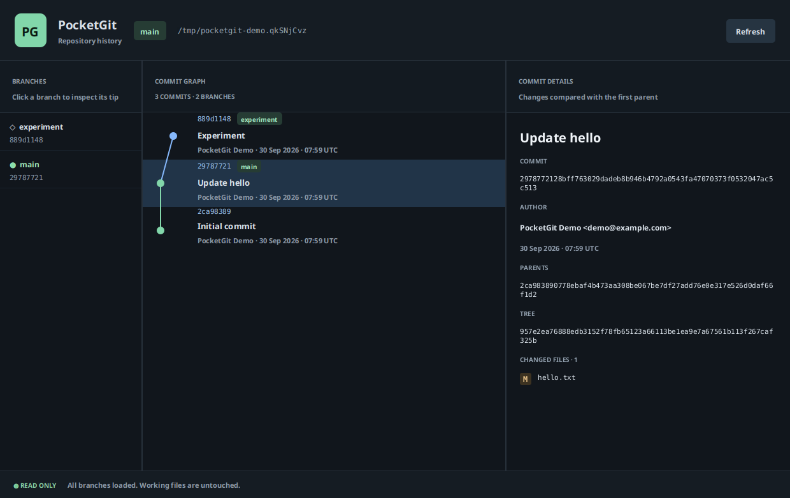

# Optional JavaFX history viewer

The CLI is the primary product. The desktop viewer is a read-only way to inspect the same verified Commit/Tree/Blob storage. It does not run Git or call external CLI commands.



## Build and launch

Requirements: JDK 21+, Maven 3.9+, and a desktop display. The optional Maven profile adds JavaFX controls and Swing integration; the default CLI build does not contain JavaFX.

```bash
mvn -Pgui clean verify
```

From a directory inside an initialized PocketGit repository:

```bash
java -jar /absolute/path/pocketgit-gui-1.0.0.jar gui
```

The unversioned `target/pocketgit-gui.jar` works too. Build the GUI on the target operating system so the shaded artifact contains appropriate JavaFX native libraries. Linux requires the standard display/GTK libraries; headless servers need a virtual display for scene smoke tests. The ordinary CLI JAR's `gui` command explains how to build the optional profile.

## Browse history

The header shows the repository path and current branch (or detached HEAD). The left panel lists branches alphabetically; clicking a branch selects and scrolls to its tip. This action only changes viewer selection, not repository HEAD or working files.

The central list combines history reachable from all branches and detached HEAD. Commits appear before their parents, even when timestamps do not increase along a branch. Colored lanes, parent connections, nodes, and branch-tip badges show the graph. Select a commit to inspect its full ID, complete message, author, timestamp, parent IDs, and root Tree.

The details panel lists sorted added, modified, and deleted paths relative to the first parent, including executable-mode changes. A root commit lists all snapshot files as additions. There is no merge-diff UI; the engine currently creates single-parent commits.

Refresh reloads refs and history. Object reads and change calculation run on a background worker; the UI does not write repository metadata. Errors appear in the viewer instead of presenting partial data as complete. Close the window to return to the shell.

## Bounds and validation

The display shows up to 2,000 commits; the reader retains its 100,000-commit traversal bound. A branch tip outside the displayed range is reported clearly. The viewer verifies source objects and references through engine readers; it is not a replacement for the whole-store `pocketgit verify` scan.

The graph renders 15 lanes and a condensed overflow column, keeping each row canvas within 344 pixels. Later lanes keep their commit nodes, actual lane numbers, and branch badges; connections involving condensed lanes are omitted. The footer reports this limit, and full parent IDs remain available in commit details.

The viewer supports an automated scene smoke mode for validation, including selected metadata and changed-file assertions:

```bash
java -Dpocketgit.gui.smoke=true \
  -Dpocketgit.gui.screenshot=/absolute/path/history-viewer.png \
  -jar /absolute/path/pocketgit-gui-1.0.0.jar gui
```

Run this from a committed temporary repository with a desktop/virtual display. The optional screenshot is captured from the actual JavaFX scene. A successful normal CLI build establishes engine behavior, not display availability; [validation evidence](validation.md) separates build results from actual scene checks.

CI also exercises the scene offscreen with checksum-pinned TestFX Monocle 21.0.2 and software rendering. Monocle is validation tooling; it is not included in either release JAR. On restricted systems, choose writable native-library and font-cache directories with `-Djavafx.cachedir=PATH` and `XDG_CACHE_HOME=PATH`. The CI scene step provides a complete example.

## Large histories and snapshots

History validation walks the union of branch histories once, rather than revisiting common ancestors for each branch tip. Changed files use a virtualized list: a 1,001-file root commit binds all its file records while creating only visible UI rows. New selections cancel obsolete detail tasks and remove queued tasks before starting the next read. The worker remains read-only. CI checks the changed-file count, bounded cell creation, scene metadata, and identical before/after repository manifests.
